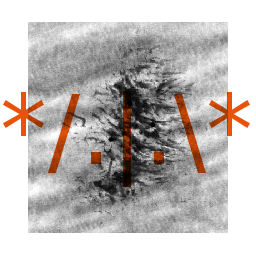

<html>
<head>
	<title>PSL1N4X : v6.3.0-aug22-N1X-VITUni-patch</title>
	<meta charset="utf-8">
</head>
<body>
	
	

	<h1>v6.3.0-aug22-N1X-VITUni-patch [*UNIX]</h1>
		<header class="logo-header">
			
			<h1>PSL1N4X</h1><h4>Compiled by $^@n1x.site/~itsN1X with woof-ce. Source code is now available on my <a href="http://github.com/itsN1X">git profile</a> and <a href="http://N1X.site">website</a>.</h4>
		
		<h3>Kernel v6.3.0-aug22-N1X-VITUni-patch</h2>
		</header>
			<h3>PSL1N4X : The blast-off page >> </h3>
		

			
				The new PSL1N4X (v6.3.0-aug22-N1X-VITUni-patch) is an i386 / x86 compatible, host-compiled member of a large family of Puppy-Linux-based distros or "puppies". Click on any of these Internet links to find out more, interact with our vibrant community, and just plain have fun!
			
			<a href="HOWTO_Internet.htm" id="connect-howto">
				
				Howto get onto the Internet
			</a>
		

		<ul id="jump-options">
			<li class="jump-option">
				
				Want detailed multi-language User Manuals, that show all aspects of setting up and using PSL1N4X?
			</li>
			<li class="jump-option">
				
				Read the latest PSL1N4X News on the community-supported Wiki News page. Find out how keen our community is!
			</li>
			<li class="jump-option">
				
				Visit our Discussion Forums and be part of the vibrant Puppy community. Find answers, post questions, chat about all sorts of things
			</li>
			<li class="jump-option">
				
				An online jumping-off place for everything Puppy-related. This site is maintained by Puppy enthusiasts ...be warned, it's catching!
			</li>
			<li class="jump-option">
				
				Developers, join GitHub and help develop the next PSL1N4X version! Join our discussion at the <a href="http://woof-ce.26403.n7.nabble.com/" target="_BLANK">Woof-CE Nabble Forum</a>
			</li>
			<li class="jump-option">
				
				Read the leading-edge Developer News, maintained by Barry Kauler and updated almost-daily. Specialised categories: <a href="http://bkhome.org/blog2/?viewCat=Puppy">Puppy</a>, <a href="http://bkhome.org/blog2/?viewCat=Woof">Woof</a>. Old blog: <a href="http://bkhome.org/blog/?viewCat=Puppy">Puppy</a>, <a href="http://bkhome.org/blog/?viewCat=Woof">Woof</a>, <a href="http://bkhome.org/blog/?viewCat=Quirky">Quirky</a>, <a href="http://bkhome.org/blog/?viewCat=Wary">Wary</a>
			</li>
			<li class="jump-option">
				
				Barry's leading-edge Developer Site has just about everything to do with setup, configuration, compiling and all the nuts-and-bolts. This is also a great getting-started site, as has many introductory web pages. Quick links: <a href="http://puppylinux.com/">Puppy</a>, <a href="http://bkhome.org/quirky/">Quirky</a>, <a href="http://bkhome.org/bacon/">BaCon</a>, <a href="http://bkhome.org/woof/">Woof</a>, <a href="http://bkhome.org/bones/">Bones</a>
			</li>
			<li class="jump-option">
				
				Download PSL1N4X. Or, if on dialup consider buying a CD.
			</li>
		</ul>
		

			
			So many exciting Internet links, but don't forget that right here in Slacko Puppy there's lots of <a href="index.html">documentation</a>. This is also available via the 'Help' entry in the menu.
		

	

</body>
</html>

---

http://PSL1N4X.github.io
# PSL1N4X v0.6.4
## (C) 2017 NIKHIL PANDITA
### Vellore, TN (INDIA)

